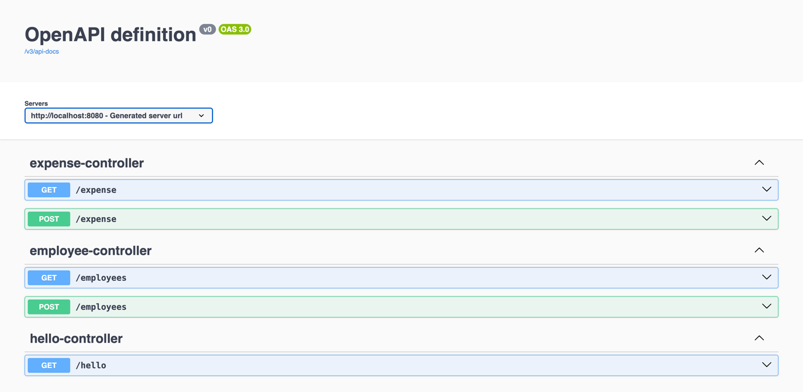
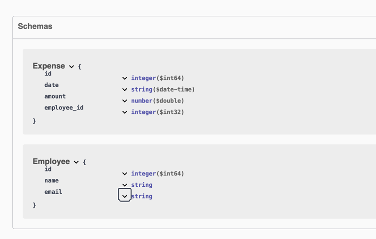

# Expense Management Application

This App serves as a backend microservice application to manage employee's expenses.

#### This is how the swagger UI documentation looks like:

#### Schemas:

### Note
 Once the app is build and in the running stage, you can access refer the swagger documentation by http://localhost:8080/swagger-ui/index.html 

## To build the application:

To run the system

Step 1: 
RUN
`mvn clean package`

The above step should give you _**jar file**_ in the [target](target) directory. 

Step 2: Build the container

RUN 
`docker compose up --build`

### Troubleshoot build process:

1. Create a new file inside  [resources](src/main/resources) package. Refer [application-example.properties](src/main/resources/application-example.properties)  for template.
2. Add `username` and `password` inside the newly created application.properties file and set **do not track the changes** by VCS. 
3. Optional: For the ease of use, you can also **create** a _**docker-compose.yml**_ file and **set** `username` and `password` by referring [docker-compose-example.yml](docker-compose-example.yml)
4. Summary:
   1. The maven file contains the compatible dependencies as per July 2025. These might change
   2. The dockerfile should be able to pick to jar output after running `mvn clean package` once the build process is `successful`. 
   3. Set up new files - 1. `docker-compose.yml` and 2. `application.properties` and configure the variables. 
   4. once, above three steps work fine, build the docker container by `docker compose up --build`